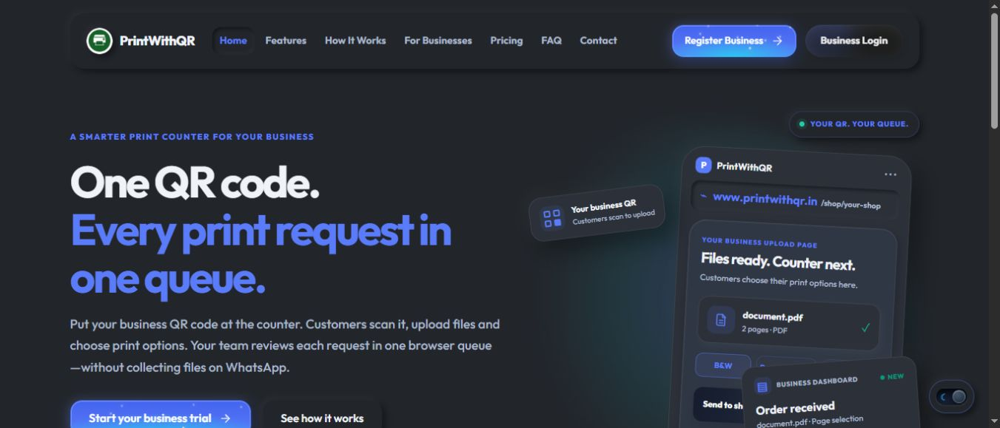

# PrintWithQR

A web app for sending documents to a local print shop through its QR code. Customers choose files and print settings in the browser; the shop handles the queue from its dashboard.

**[Live site](https://www.printwithqr.in/)** · [Setup](docs/setup.md) · [Architecture](docs/architecture.md) · [Database](supabase/README.md) · [Verification](docs/verification.md)



## What it does

- Gives each shop a QR link for PDFs, PNG/JPEG images and ZIP archives, with a 50 MB limit per file.
- Previews documents and offers page ranges, colour, paper size and image layout options.
- Uses private Storage and exact-file upload capabilities; shop downloads require verified membership and short-lived URLs.
- Calculates PDF page counts and prices on the server. ZIP prices stay pending for the shop to confirm.
- Shows a receipt for the complete customer batch and live queue updates through Supabase Realtime.
- Supports shop accounts, print rates, free trial quotas and Razorpay subscription payments.
- Expires waiting jobs after ten minutes and removes eligible files through an authenticated cleanup worker while retaining order metadata.

The shop still fulfils the order. There is no desktop printer agent or direct printer integration.

## Stack

| Part | Technologies |
| --- | --- |
| Interface | React, JavaScript, React Router, Vite, CSS, Lucide |
| API | JavaScript serverless handlers on Vercel |
| Data | Supabase Postgres, Auth, private Storage and Realtime |
| Documents | PDF.js, pdf-lib, zip.js and browser image tools |
| Payments | Razorpay Checkout and server-side signature verification |
| Public pages | Build-generated marketing pages, metadata and sitemap |

## Run locally

Use Node.js 24 (`.nvmrc`) and a separate development Supabase project.

```sh
git clone https://github.com/itsshashank09/PrintWithQR.git
cd PrintWithQR
npm run setup
npm run dev:ui
```

This starts the interface on the URL Vite prints. Authenticated workflows also need the database baseline, environment variables and serverless API described in [setup](docs/setup.md). `npm run dev` starts the Vercel development environment.

```sh
npm run check                # API parity, lint, offline tests, SEO and build
npm run test:integration     # Synthetic workflows in a disposable Supabase project
```

## Code worth reading

- [`api/platform.js`](api/platform.js): verified shop membership, upload intents, customer receipts and document access.
- [`api/_lib/orders.js`](api/_lib/orders.js): uploaded-file inspection and server-selected prices.
- [`supabase/migrations/20261005000000_application_baseline.sql`](supabase/migrations/20261005000000_application_baseline.sql): schema, RLS and transactional order/quota updates.
- [`api/_lib/queue-cleanup.js`](api/_lib/queue-cleanup.js): queue expiry and private-file removal.
- [`frontend/src/pages/Upload.jsx`](frontend/src/pages/Upload.jsx) and [`frontend/src/components/PrintQueue.jsx`](frontend/src/components/PrintQueue.jsx): customer and shop workflows.

## Structure

```text
api/                   Serverless handlers for a repository-root deployment
frontend/
  api/                 Matching handlers for a frontend-root deployment
  src/                 Customer, shop and admin interface
  seo/                 Public page content and metadata
  scripts/             Marketing build
supabase/migrations/   Fresh-install application baseline
supabase/history/      Earlier production migrations, kept as reference
scripts/               Development tools and isolated integration tests
tests/                 Offline workflow and authorization checks
docs/                  Setup, architecture, verification and source recovery
```

The API copies are checked by `npm run check:api`. [Source reconciliation](docs/source-reconciliation.md) records how this repository was brought into line with the newer deployed app. Main-branch automatic deployment is disabled; production releases use the manual workflow.

## Current limits

The database restore and core authenticated workflows have been tested with synthetic data. Razorpay checkout, SMTP, full browser journeys and production load have not been covered by those integration tests. File retention depends on a correctly configured worker; browser fingerprinting is an abuse signal, not a guarantee of identity. [Verification](docs/verification.md) describes the checks and their scope.

## Licence

The project is proprietary, as stated in the original repository documentation. No open-source licence is granted by this README.
